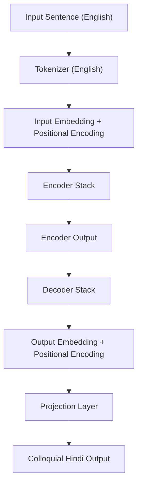

# Transformer from Scratch

This repository contains a PyTorch implementation of a Transformer model for English-to-Colloquial Hindi translation. All components are implemented from scratch. The code is organized for training, inference, and attention visualization.

## Repository Structure

- `config.py`: Central configuration (hyperparameters, paths, weight file naming).
- `dataset.py`: PyTorch `Dataset` for bilingual data, tokenization, and padding.
- `model.py`: Transformer model and all submodules.
- `train.py`: Training loop, validation, metrics, tokenizer building, checkpointing.
- `inference.ipynb`: Jupyter notebook for model inference and validation.
- `attention_visual.ipynb`: Jupyter notebook for visualizing attention maps.
- `tokenizer_english.json`: Pretrained English tokenizer (WordLevel, JSON).
- `tokenizer_hindi.json`: Pretrained Hindi tokenizer (WordLevel, JSON).
- `.gitignore`: Git ignore rules for untracked/generated files.
- `LICENSE`: MIT License.
- `README.md`: This documentation.

## Getting Started

1. Clone the repository:
   ```bash
   git clone https://github.com/AnandVadgama/pytorch-transformer-from-scratch.git
   cd pytorch-transformer-from-scratch
   ```
2. Install dependencies:
   ```bash
   pip install torch torchvision torchaudio datasets tokenizers tqdm
   ```
3. Train the model:
   ```bash
   python train.py
   ```
4. Run inference or visualize attention:
   Open `inference.ipynb` or `attention_visual.ipynb` in Jupyter or Colab.

## Model Architecture



## License

MIT License. See `LICENSE` file.
